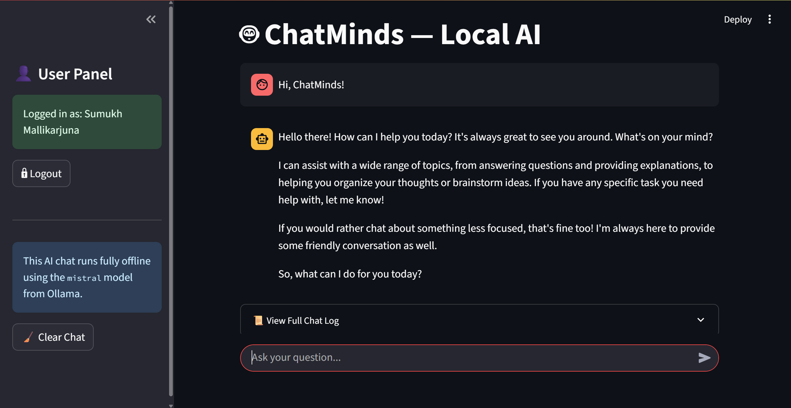

# 🤖 ChatMinds – Your Personal AI Chat Assistant

Welcome to **ChatMinds**, an AI-powered chatbot built using **Streamlit**, **LangChain**, and **Ollama** that runs entirely **locally**. No OpenAI API keys or internet required — just your own CPU and curiosity!



---

## 🚀 Features

- 🔐 **Secure login/logout** with `streamlit-authenticator`
- 🧠 **Context-aware chat memory** (remembers past interactions)
- ⚡ **Runs fully offline** using local Ollama models like `mistral`, `llama2`, etc.
- 🧩 **Modular structure** for easy customization
- 🧼 **Clear Chat** option to reset conversations
- 🎨 Clean UI with sidebar navigation

---

## 🛠️ Tech Stack

- [Streamlit](https://streamlit.io/) – Web UI
- [LangChain](https://www.langchain.com/) – Prompt & memory management
- [Ollama](https://ollama.com/) – Local AI model runner (supports `mistral`, `llama2`, etc.)
- [streamlit-authenticator](https://github.com/mkhorasani/Streamlit-Authenticator) – Login/logout system

---

## 📁 Folder Structure

chat-minds/
├── main.py
├── config_sample.yaml
├── hash_sample_pass.py
├── .gitignore
├── README.md
└── requirements.txt


---

## 🔧 Setup Instructions

## ✅ Install Ollama and model

Install [Ollama](https://ollama.com/download) and run:

```bash
~ollama run mistral

Or use other models:
~ollama pull llama2
```
---

## ✅ Create virtual environment
```bash
~python -m venv venv
~source venv/bin/activate  # On Windows: venv\Scripts\activate
```

## ✅ 3. Install dependencies
```bash
~pip install -r requirements.txt
```
=>requirements.txt/
    streamlit
    streamlit-authenticator
    pyyaml
    langchain
    langchain-community
    langchain-core
    langchain-ollama
    ollama
    bcrypt

## ✅ 4. Prepare configuration
Rename config_sample.yaml to config.yaml and update usernames and hashed passwords.

To hash a new password:
```bash
~python hash_sample_pass.py
```

## ▶️ Run the App
```bash
~streamlit run main.py
```
=>Then open http://localhost:8501 in your browser.

## 🧠 Supported Models
You can easily swap models by updating:

llm = OllamaLLM(model="mistral")
Some options:
*mistral
*llama2
*gemma
*codellama
*phi3

## 📜 License
=>This project is licensed under the MIT License.

## 🌟 Acknowledgments
=>Streamlit
=>LangChain
=>Ollama
=>Streamlit Authenticator
